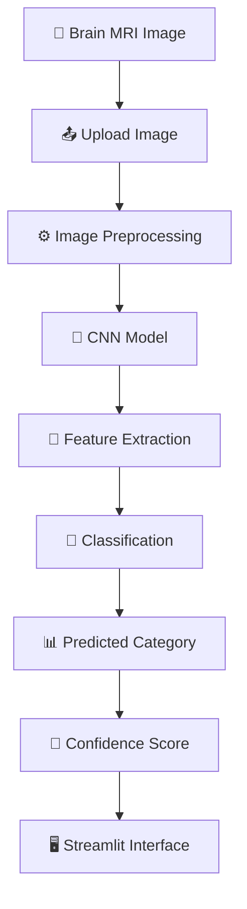
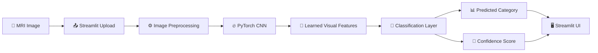

<div align="center">

# 🧠 NeuroVision

### 🏥 AI-Powered Brain MRI Classification for Dementia-Related Categories

**A deep-learning application that uses Convolutional Neural Networks (CNNs) to analyze brain MRI images and provide an AI-based classification with a confidence score.**

<br>


<br>

> 🧠 **Upload a brain MRI → Preprocess the image → Run CNN inference → Predict a dementia-related category → Display confidence**

<br>

⚠️ **Educational & Research Project — Not for Clinical Diagnosis**

<br><br>

[🧠 Overview](#-overview) •
[🔬 How It Works](#-how-it-works) •
[🤖 Model](#-deep-learning-model) •
[🖥️ App](#️-streamlit-application) •
[🚀 Setup](#-installation) •
[🔮 Future](#-future-improvements)

</div>

---

# 📌 Table of Contents

- [🧠 Overview](#-overview)
- [🎯 Project Goal](#-project-goal)
- [✨ Features](#-features)
- [🔬 How It Works](#-how-it-works)
- [🏗️ System Architecture](#️-system-architecture)
- [🤖 Deep Learning Model](#-deep-learning-model)
- [🖼️ Image Processing Pipeline](#️-image-processing-pipeline)
- [📊 Prediction Output](#-prediction-output)
- [🖥️ Streamlit Application](#️-streamlit-application)
- [📂 Project Structure](#-project-structure)
- [⚙️ Installation](#️-installation)
- [▶️ Run the Application](#️-run-the-application)
- [🧪 Using NeuroVision](#-using-neurovision)
- [💾 Model & Git LFS](#-model--git-lfs)
- [☁️ Streamlit Deployment](#️-streamlit-deployment)
- [🧰 Technology Stack](#-technology-stack)
- [🔮 Future Improvements](#-future-improvements)
- [👨‍💻 Author](#-author)
- [⚠️ Medical Disclaimer](#️-medical-disclaimer)

---

# 🧠 Overview

**NeuroVision** is an AI-powered medical imaging application that uses a **Convolutional Neural Network (CNN)** to classify brain MRI images into dementia-related categories.

The application provides a simple **Streamlit web interface** where a user can upload a brain MRI image and receive:

- 🧠 AI-based image classification
- 📊 Predicted category
- 🎯 Model confidence score
- ⚡ Fast inference through a trained PyTorch model

The project is designed to demonstrate how **deep learning + computer vision + medical imaging** can be combined into an accessible AI application. :contentReference[oaicite:1]{index=1}

---

# 🎯 Project Goal

The main goal of NeuroVision is to demonstrate the application of **deep learning and computer vision to medical image classification**. :contentReference[oaicite:2]{index=2}

The complete concept can be summarized as:

```text
🧠 Medical Imaging
        │
        ▼
🖼️ Brain MRI
        │
        ▼
⚙️ Image Preprocessing
        │
        ▼
🤖 CNN Deep Learning
        │
        ▼
🔎 Feature Extraction
        │
        ▼
🧬 Image Classification
        │
        ▼
📊 Prediction + Confidence
        │
        ▼
🖥️ Interactive Web Application
```

---

# ✨ Features

<table>
<tr>
<td width="50%">

### 🧠 Medical Imaging

- 🧠 Brain MRI classification
- 🖼️ MRI image upload
- 🔬 Automated image analysis
- 📊 Prediction confidence

</td>

<td width="50%">

### 🤖 AI & Deep Learning

- 🧠 CNN-based architecture
- 🔥 PyTorch inference
- ⚡ Fast prediction
- 📦 Saved trained model

</td>
</tr>

<tr>
<td>

### 🖥️ Interactive Application

- 🌐 Streamlit interface
- 📤 Simple image upload
- 📊 Prediction display
- 🎯 Confidence visualization

</td>

<td>

### 🛠️ Development

- 🐍 Python
- 🔥 PyTorch
- 🖼️ Pillow
- 🔢 NumPy
- 🌐 Streamlit
- 📦 Git LFS

</td>
</tr>
</table>

The original project README specifically documents MRI classification, a CNN model, image upload, prediction confidence, Streamlit, PyTorch inference, and Git LFS model management. :contentReference[oaicite:3]{index=3}

---

# 🔬 How It Works

NeuroVision follows a straightforward medical-image classification pipeline.



### Pipeline Overview

```text
┌──────────────────────────┐
│     🧠 Brain MRI         │
└─────────────┬────────────┘
              │
              ▼
┌──────────────────────────┐
│    📤 Image Upload       │
└─────────────┬────────────┘
              │
              ▼
┌──────────────────────────┐
│ ⚙️ Image Preprocessing   │
└─────────────┬────────────┘
              │
              ▼
┌──────────────────────────┐
│    🤖 CNN Inference      │
└─────────────┬────────────┘
              │
              ▼
┌──────────────────────────┐
│ 🔎 Feature Extraction    │
└─────────────┬────────────┘
              │
              ▼
┌──────────────────────────┐
│    🧬 Classification      │
└─────────────┬────────────┘
              │
              ▼
┌──────────────────────────┐
│ 📊 Prediction +          │
│ 🎯 Confidence Score      │
└──────────────────────────┘
```

The documented workflow is MRI image → upload → preprocessing → CNN → feature extraction → classification → predicted category → confidence score. :contentReference[oaicite:4]{index=4}

---

# 🏗️ System Architecture



### NeuroVision Architecture

```text
             🧠 INPUT
                │
                ▼
        ┌───────────────┐
        │   MRI Image   │
        └───────┬───────┘
                │
                ▼
        ┌───────────────┐
        │ Preprocessing │
        └───────┬───────┘
                │
                ▼
        ┌───────────────┐
        │   CNN Model   │
        │    PyTorch    │
        └───────┬───────┘
                │
                ▼
        ┌───────────────┐
        │    Feature    │
        │   Extraction  │
        └───────┬───────┘
                │
                ▼
        ┌───────────────┐
        │ Classification│
        └───────┬───────┘
                │
          ┌─────┴─────┐
          ▼           ▼
     🧬 Category   🎯 Confidence
          │           │
          └─────┬─────┘
                ▼
        🖥️ Streamlit UI
```

---

# 🤖 Deep Learning Model

## 🧠 Convolutional Neural Network

NeuroVision uses a trained **PyTorch CNN model** stored in:

```text
best_model.pth
```

The CNN processes the input MRI image, learns visual patterns, extracts features, and performs the final classification. :contentReference[oaicite:5]{index=5}

### Conceptual CNN Flow

```text
🖼️ MRI Image
     │
     ▼
┌───────────────┐
│ Convolution   │
│   Layers      │
└───────┬───────┘
        │
        ▼
┌───────────────┐
│ Feature Maps  │
└───────┬───────┘
        │
        ▼
┌───────────────┐
│ Pooling       │
└───────┬───────┘
        │
        ▼
┌───────────────┐
│ Deep Feature  │
│ Extraction    │
└───────┬───────┘
        │
        ▼
┌───────────────┐
│ Classification│
└───────┬───────┘
        │
        ▼
🧠 Predicted Class
```

> ℹ️ The repository README identifies the model as a trained PyTorch CNN, but does not document the exact CNN layer-by-layer architecture. :contentReference[oaicite:6]{index=6}

---

# 🖼️ Image Processing Pipeline

Before the image reaches the neural network, it is converted into the format expected by the trained model.

```text
📤 Uploaded MRI
      │
      ▼
🖼️ Image Loading
      │
      ▼
⚙️ Preprocessing
      │
      ▼
🔢 Model-Ready Tensor
      │
      ▼
🔥 PyTorch CNN
```

The project's documented process states that the uploaded MRI is preprocessed into the format expected by the trained CNN before inference. :contentReference[oaicite:7]{index=7}

---

# 📊 Prediction Output

After processing an MRI image, the application displays:

```text
┌─────────────────────────────────┐
│        🧠 NEUROVISION           │
├─────────────────────────────────┤
│                                 │
│  🖼️ MRI Image                   │
│                                 │
│  🧬 Predicted Category          │
│                                 │
│  🎯 Confidence Score            │
│                                 │
└─────────────────────────────────┘
```

### Example Output

```text
🧬 Prediction
        │
        ▼
   [ Predicted
      Class ]
        │
        ▼
🎯 Confidence: XX.XX%
```

> ⚠️ The confidence score is produced by the machine-learning model and should not be interpreted as clinical certainty.

---

# 🖥️ Streamlit Application

NeuroVision provides an interactive **Streamlit web application** for image upload and model inference. :contentReference[oaicite:8]{index=8}

### Application Flow

```text
┌─────────────────────────────┐
│ 🧠 NeuroVision              │
│                             │
│ 📤 Upload Brain MRI         │
│            ↓                │
│ ⚙️ Preprocess Image         │
│            ↓                │
│ 🤖 CNN Inference            │
│            ↓                │
│ 🧬 Predicted Category       │
│            ↓                │
│ 🎯 Confidence Score         │
└─────────────────────────────┘
```

### User Experience

The application is designed to keep the workflow simple:

```text
1️⃣ Open NeuroVision

       ↓

2️⃣ Upload MRI Image

       ↓

3️⃣ Wait for AI Inference

       ↓

4️⃣ View Prediction

       ↓

5️⃣ View Confidence Score
```

---

# 📂 Project Structure

```text
NeuroVision/
│
├── 📄 app.py
│
├── 🧠 best_model.pth
│
├── 📦 requirements.txt
│
├── ⚙️ .gitattributes
│
├── 🚫 .gitignore
│
├── 📖 README.md
│
└── ...
```

### Important Files

| File | Purpose |
|:---|:---|
| `app.py` | 🖥️ Main Streamlit application |
| `best_model.pth` | 🧠 Trained PyTorch CNN model |
| `requirements.txt` | 📦 Python dependencies |
| `.gitattributes` | 📦 Git LFS configuration |
| `.gitignore` | 🚫 Git-excluded files |
| `README.md` | 📖 Project documentation |

This structure matches the project files documented in the original README. :contentReference[oaicite:9]{index=9}

---

# 🧰 Technology Stack

| Technology | Role |
|:---|:---|
| 🐍 **Python** | Core development |
| 🔥 **PyTorch** | Deep learning framework |
| 🧠 **CNN** | MRI image classification |
| 🖼️ **Pillow** | Image loading and processing |
| 🔢 **NumPy** | Numerical operations |
| 🌐 **Streamlit** | Interactive web interface |
| 🔧 **Git** | Version control |
| 🐙 **GitHub** | Repository hosting |
| 📦 **Git LFS** | Large model-file storage |
| 📓 **Google Colab / Jupyter** | Model development |

These are the technologies documented for the project. :contentReference[oaicite:10]{index=10}

---

# ⚙️ Installation

## 1️⃣ Clone the Repository

```bash
git clone https://github.com/SoudipMondal12/NeuroVision.git
```

Then:

```bash
cd NeuroVision
```

---

# 🐍 2️⃣ Create a Virtual Environment

```bash
python -m venv venv
```

### 🪟 Windows

```powershell
venv\Scripts\activate
```

---

# 📦 3️⃣ Install Dependencies

```bash
pip install -r requirements.txt
```

---

# ▶️ Run the Application

Start the Streamlit application:

```bash
streamlit run app.py
```

The application will then open in your web browser.

Typical local address:

```text
http://localhost:8501
```

---

# 🧪 Using NeuroVision

Follow these simple steps:

### 1️⃣ Launch the App

```bash
streamlit run app.py
```

### 2️⃣ Upload an MRI

Use the image uploader to provide a supported brain MRI image.

### 3️⃣ Automatic Processing

The application preprocesses the uploaded image.

### 4️⃣ AI Inference

The trained PyTorch CNN analyzes the image.

### 5️⃣ View Prediction

The predicted dementia-related category is displayed.

### 6️⃣ View Confidence

The application also displays the model's confidence score.

This workflow is documented in the original project README. :contentReference[oaicite:11]{index=11}

---

# 💾 Model & Git LFS

The trained model is stored as:

```text
best_model.pth
```

Because the model is approximately **300 MB**, the project uses **Git Large File Storage (Git LFS)** rather than standard Git storage. :contentReference[oaicite:12]{index=12}

### Install Git LFS

```bash
git lfs install
```

Then pull the model:

```bash
git lfs pull
```

### Verify LFS Tracking

Run:

```bash
git lfs ls-files
```

You should see:

```text
best_model.pth
```

---

# 📦 Git LFS Workflow

```text
🧠 Large CNN Model
        │
        ▼
   best_model.pth
        │
        ▼
     Git LFS
        │
        ▼
     GitHub
        │
        ▼
     git lfs pull
        │
        ▼
🖥️ Local Application
```

### Clone + Download Model

```bash
git clone https://github.com/SoudipMondal12/NeuroVision.git
```

```bash
cd NeuroVision
```

```bash
git lfs pull
```

---

# ☁️ Streamlit Deployment

NeuroVision can be deployed using **Streamlit Community Cloud**. :contentReference[oaicite:13]{index=13}

### Deployment Flow

```text
🐙 GitHub Repository
        │
        ▼
☁️ Streamlit Community Cloud
        │
        ▼
📄 app.py
        │
        ▼
📦 requirements.txt
        │
        ▼
🧠 best_model.pth
        │
        ▼
🌐 NeuroVision Web App
```

### Deployment Configuration

Use:

```text
Repository:
SoudipMondal12/NeuroVision

Branch:
main

Main file:
app.py
```

Streamlit installs the dependencies from:

```text
requirements.txt
```

and launches:

```text
app.py
```

---

# 🏥 Medical AI Workflow

NeuroVision demonstrates how several technologies can connect in a medical-AI workflow:

```text
        🧠 MEDICAL IMAGING
               │
               ▼
          🖼️ BRAIN MRI
               │
               ▼
       ⚙️ PREPROCESSING
               │
               ▼
        🤖 DEEP LEARNING
               │
               ▼
          🧠 CNN MODEL
               │
               ▼
       🔎 FEATURE LEARNING
               │
               ▼
       🧬 CLASSIFICATION
               │
               ▼
        📊 AI PREDICTION
               │
               ▼
       🎯 CONFIDENCE SCORE
               │
               ▼
        🖥️ USER INTERFACE
```

---

# 🔬 Project Goal in One Line

```text
🧠 Medical Imaging
      ↓
🤖 Deep Learning
      ↓
🖼️ Image Classification
      ↓
🌐 Interactive AI Application
```

This is the central project concept documented in NeuroVision. :contentReference[oaicite:14]{index=14}

---

# 🔮 Future Improvements

The project README identifies several planned directions. :contentReference[oaicite:15]{index=15}

### 🧠 Model Improvements

- Improve model accuracy
- Add additional training
- Use data augmentation
- Experiment with transfer learning
- Explore modern CNN architectures

### 🔍 Explainable AI

Possible integration of:

```text
🧠 CNN Prediction
       │
       ▼
🔍 Grad-CAM
       │
       ▼
🗺️ Highlight Important Image Regions
```

### 📊 Application Improvements

- Prediction history
- More detailed visual analysis
- Improved UI/UX
- Better inference performance
- Improved deployment scalability

---

# 🧭 Future Vision

A possible evolution of NeuroVision could look like:

```text
                    NeuroVision
                        │
        ┌───────────────┼────────────────┐
        │               │                │
        ▼               ▼                ▼
     🧠 CNN        🔍 Explainability    📊 Analytics
        │               │                │
        ▼               ▼                ▼
   MRI Prediction    Grad-CAM       History / Trends
        │               │                │
        └───────────────┼────────────────┘
                        ▼
                 🖥️ AI Dashboard
```

> ℹ️ These represent potential future directions, not currently documented capabilities.

---

# 📌 Quick Technical Summary

```text
┌─────────────────────────────────────┐
│          🧠 NEUROVISION             │
├─────────────────────────────────────┤
│                                     │
│ Input                               │
│   🖼️ Brain MRI Image               │
│                                     │
│ Processing                          │
│   ⚙️ Image Preprocessing            │
│                                     │
│ Model                               │
│   🤖 PyTorch CNN                   │
│                                     │
│ Output                              │
│   🧬 Predicted Category             │
│   🎯 Confidence Score               │
│                                     │
│ Interface                           │
│   🌐 Streamlit                     │
│                                     │
│ Model Storage                       │
│   📦 Git LFS                        │
│                                     │
└─────────────────────────────────────┘
```

---

# ⭐ Project Highlights

<table>
<tr>
<td width="50%">

### 🧠 AI

✅ CNN-based classification  
✅ PyTorch inference  
✅ Medical image processing  
✅ Automated prediction  

</td>

<td width="50%">

### 🏥 Medical Imaging

✅ Brain MRI analysis  
✅ Dementia-related categories  
✅ Confidence score  
✅ Interactive interface  

</td>
</tr>

<tr>
<td>

### 🖥️ Application

✅ Streamlit web app  
✅ Simple image upload  
✅ Fast inference  
✅ User-friendly workflow  

</td>

<td>

### 🛠️ Engineering

✅ GitHub integration  
✅ Git LFS  
✅ Large model support  
✅ Streamlit deployment  

</td>
</tr>
</table>

---

# 👨‍💻 Author

<div align="center">

## Soudip Mondal

### 🧠 Machine Learning • AI • Computer Vision

Building practical AI applications that connect deep learning with real-world problems. 🚀

<br>

🐙 GitHub: [@SoudipMondal12](https://github.com/SoudipMondal12)

<br><br>

⭐ **If you find NeuroVision interesting, consider giving the repository a star!**

</div>

---

# ⚠️ Medical Disclaimer

<div align="center">

### 🚨 IMPORTANT

**NeuroVision is an educational and research-oriented project.**

It is **NOT intended for:**

❌ Medical diagnosis  
❌ Clinical decision-making  
❌ Treatment recommendations  
❌ Replacing healthcare professionals  

</div>

The model's predictions should **not** replace evaluation, diagnosis, or treatment by a qualified healthcare professional. The project README explicitly defines NeuroVision as an educational/research project and includes this medical limitation. :contentReference[oaicite:16]{index=16}

---

# 🧠 NeuroVision — Final Pipeline

```text
                 🏥 MEDICAL AI
                      │
                      ▼
                🧠 BRAIN MRI
                      │
                      ▼
               📤 IMAGE UPLOAD
                      │
                      ▼
             ⚙️ PREPROCESSING
                      │
                      ▼
                🤖 PYTORCH
                      │
                      ▼
                   🧠 CNN
                      │
                      ▼
             🔎 FEATURE EXTRACTION
                      │
                      ▼
              🧬 CLASSIFICATION
                      │
                      ▼
             📊 PREDICTED CLASS
                      │
                      ▼
              🎯 CONFIDENCE SCORE
                      │
                      ▼
               🌐 STREAMLIT
                      │
                      ▼
              👨‍⚕️ HUMAN REVIEW
```

---

<div align="center">

# 🧠 NeuroVision

### **See the Image. Learn the Pattern. Explore the Prediction.**

<br>

🧠 **CNN** • 🖼️ **MRI** • 🔥 **PyTorch** • 🌐 **Streamlit** • 📦 **Git LFS**

<br>

⚠️ **For educational and research purposes only.**

<br>

⭐ **Star the repository if you like the project!** ⭐

</div>
